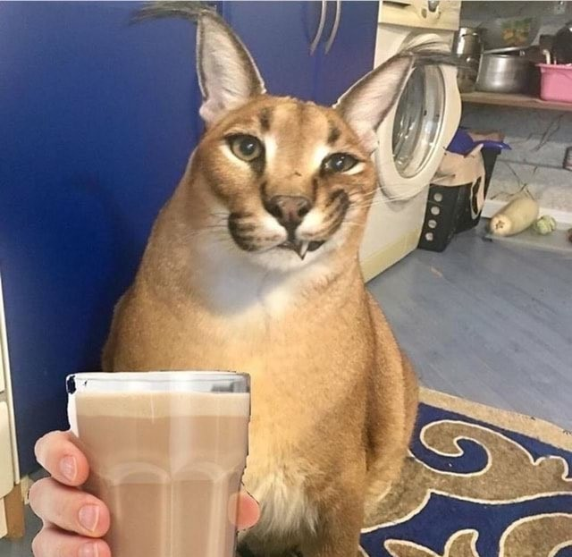
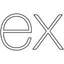

    
  <h1 style="border-bottom: none; margin-bottom: 5px;">Gilberto Bispo</h1>
  
Estudante e entusiasta de Desenvolvimento Web

  
   

  
  
  
    

<h2>🧠 Sobre mim</h2>

  Comecei no mundo da programação apenas como um hobby, estudando de forma autodidata, mas recentemente decidi ir além.

  Hoje, estudo programação com foco em desenvolvimento **full stack**, sempre orientado à criação de projetos práticos, porque não existe forma melhor de realmente aprender além de colocar a mão na massa. 🛠️

 

<h2>💻 Tecnologias que estou utilizando</h2>

  
  
  
  
  
  
  
  

 

<h2>🛠️ O que ando desenvolvendo</h2>

  

    📝 To-Do List (Full Stack)
  

  
  

    Acho que esse é o tipo de projeto considerado como o "Hello World" do desenvolvimento full stack. Este é o meu primeiro desafio real, e devo dizer que está sendo uma experiência enriquecedora desenvolvê-lo.
  

  <h4 style="margin-left: 15px;">🚀 Funcionalidades</h4>
  <ul style="margin-left: 35px;">
    <li>Criar, editar, visualizar e deletar tarefas (CRUD completo)</li>
    <li>Persistência de informações com banco de dados em **PostgreSQL**</li>
    <li>Interface com interações dinâmicas (como menus expansíveis e animações)</li>
    <li>Responsividade (para usar no PC e no celular)</li>
  </ul>

  <h4 style="margin-left: 15px; color: #9E9E9E;">🔮 Futuras features</h4>
  <ul style="margin-left: 35px; color: #9E9E9E;">
    <li>Filtro para tarefas concluídas e não concluídas (em progresso)</li>
    <li>Sistema de registro e login de usuários completo e seguro</li>
    <li>Melhorias constantes no design</li>
  </ul>

 

<h2>🎯 Objetivos</h2>

Meus objetivos de agora em diante envolvem:

<ul>
  <li>
    Criar projetos cada vez mais complexos e profissionais, me permitindo aprender enquanto os construo (aprendendo também sobre boas práticas 😉), evoluindo cada vez mais como desenvolvedor full stack.
  </li>
  <li>
    Conquistar minha primeira oportunidade profissional, de modo a aplicar o que aprendo e a me habituar com rotinas profissionais na área de desenvolvimento.
  </li>
</ul>

 

  
Vamos nos conectar?

  
  

