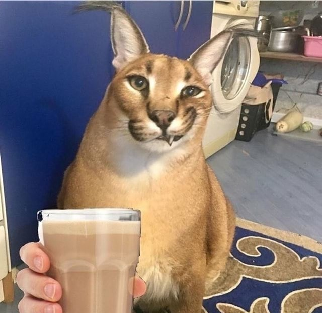
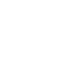

    
  <h1 style="border-bottom: none; margin-bottom: 5px;">Gilberto Bispo</h1>
  
Web Development student and enthusiast

  
   

  
  
  
  
    

<h2>🧠 About me</h2>

  I started in web development just as a hobby, studying on my own, but recently I decided to take it further.

  Today, I study development focusing on Next.js, TypeScript and TailwindCSS, always aiming to create hands-on projects, because there's no better way to truly learn than by getting your hands dirty.

 

<h2>💻 Technologies that I'm using</h2>

  
  
  

 

<h2>🎯 Goals</h2>

  My goals from now on are:

<ul>
  <li>
    Create increasingly complex and professional projects, allowing me to learn as I build (while focusing on best practices 😉), and continuously evolve as a developer.
  </li>
  <li>
    Take on professional remote opportunities and deliver high-impact web solutions.
  </li>
</ul>

 

  
Let's connect ?

  
  

